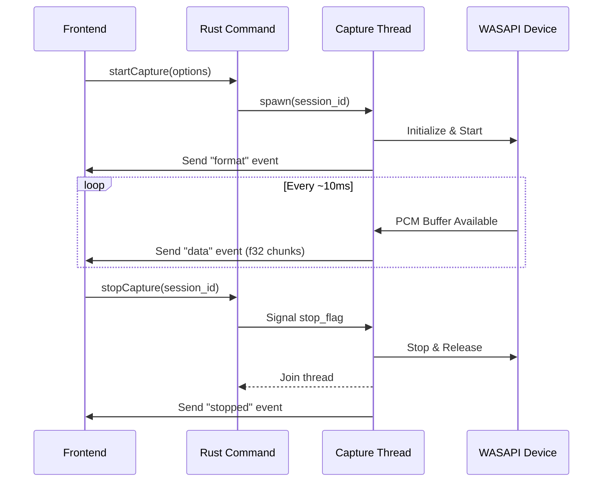

# Architecture

This document describes the high-level architecture of the `tauri-plugin-wasapi` and how it bridges the Windows Audio Session API with Tauri's frontend.

## Overview

The plugin operates by spawning dedicated background threads in Rust to handle real-time audio capture. This ensures that the primary Tauri runtime and the webview's main thread are not blocked by the synchronous, low-latency requirements of audio processing.

## Key Components

### 1. `Wasapi` State Manager (`desktop.rs`)
The `Wasapi` struct is managed as Tauri state. It holds a thread-safe map (`HashMap`) of active `CaptureSession` objects. This allows the plugin to manage multiple simultaneous streams (e.g., capturing from a microphone while also loopbacking system audio).

### 2. Capture Thread (`desktop.rs`)
Each session runs in its own OS thread. The thread is responsible for:
- Initializing COM (Multi-Threaded Apartment).
- Negotiating the audio format (always forced to 32-bit float PCM for frontend consistency).
- Handling buffer events from WASAPI.
- Interleaving audio channels into a flat byte array for IPC transmission.

### 3. Application-Specific Loopback
On Windows 10 (build 20348) and later, the plugin utilizes the `AUDIOCLIENT_ACTIVATION_PARAMS` to perform loopback capture on a specific Process ID rather than an entire audio device. This is handled transparently by the `AudioClient::new_application_loopback_client` call in the Windows backend.

### 4. IPC Communication
The plugin leverages Tauri's **Channel IPC**.
- **Commands**: Simple `invoke` calls are used for control (start, stop, list).
- **Streams**: A `Channel` is passed from the frontend to the backend during `start_capture`. The backend then pushes `StreamEvent` objects (encapsulated as JSON) over this channel.

## Performance Considerations

### Latency
The capture loop uses event-driven shared mode with WASAPI. By default, it requests a chunk size of 4096 frames (~85ms at 48kHz). This balance provides low enough latency for visualizations while maintaining high reliability and low CPU usage.

### Thread Safety
All access to the session map is protected by a `Mutex`. Capture threads only hold a clone of the `stop_flag` (an `AtomicBool`), ensuring they can be signaled to stop without complex locking requirements that could lead to deadlocks during high-pressure audio processing.
